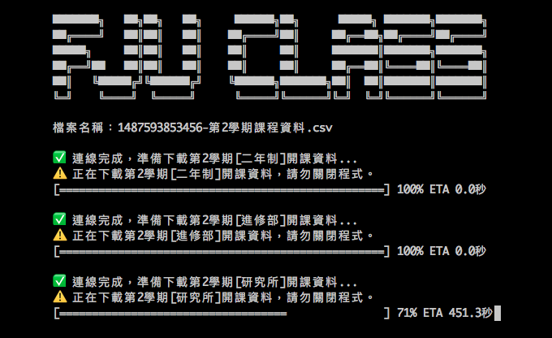

# FJU Class Crawler


輔仁大學開課資料查詢系統爬蟲

## Installation
Just clone this repo and install dependencies.

```
$ npm install
```

## Usage
```
$ node app.js <上/下學期>
```

## Example
開課系統分別提供上/下學期的開課資料，使用者可依需求使用以下參數：

```
$ node app.js 1		// 下載上學期課程資料
$ node app.js 2		// 下載下學期課程資料
```
下載的課程資料會儲存在當前目錄`<時間戳記>-第1/2學期課程資料.csv`的檔案裡，例如：

```
1487593853456-第2學期課程資料.csv
```

## Features
- [X] 下載所有開課部別資料，包含「日間部」、「進修部」、「研究所」和「二年制」
- [X] 自動匯出成.csv檔
- [ ] 改善csv建檔速度
- [ ] 自訂要下載的開課部別
- [ ] 自訂要下載的開課單位
- [ ] 自訂檔案儲存位置和名稱
- [ ] 更好的介面設計
- [ ] 使用第二代課程查詢系統（比起現在會缺少部分資料）